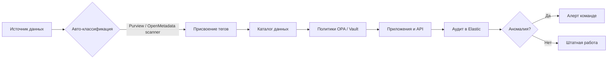

# Механизм тегирования данных

## 1. Цель

Обеспечить автоматическое определение чувствительных данных, применение политик защиты и проверку на этапе CI/CD (согласно целевому состоянию «Медикаменте»).

## 2. Таксономия тегов

### 2.1. Уровень чувствительности (sensitivity)

| Тег | Описание | Пример данных |
|-----|----------|---------------|
| `pub` | Публичные | Расписание врачей (без ПДн) |
| `int` | Внутренние | Статистика посещений (агрегированная) |
| `pii` | Персональные данные | ФИО, телефон, e-mail |
| `pii.sensitive` | Специальные категории ПДн | Диагнозы, анализы, хронические заболевания |
| `fin` | Финансовые | Платежи, договоры |
| `hr` | Кадровые | Зарплата, паспортные данные сотрудников |

### 2.2. Домен данных (domain)

| Тег | Описание |
|-----|----------|
| `domain.patient` | Данные пациента |
| `domain.appointment` | Записи на приём |
| `domain.medical` | Медицинская информация |
| `domain.laboratory` | Лабораторные данные |
| `domain.billing` | Оплата и договоры |
| `domain.hr` | Кадры |
| `domain.inventory` | ТМЦ |

### 2.3. Политики обработки (policy)

| Тег | Действие |
|-----|----------|
| `policy.encrypt` | Обязательное шифрование at rest |
| `policy.mask` | Маскирование при отображении |
| `policy.anonymize` | Обезличивание для аналитики |
| `policy.audit` | Обязательный аудит доступа |
| `policy.retention.3y` | Хранение 3 года |
| `policy.retention.5y` | Хранение 5 лет (мед. документы) |
| `policy.delete.on_request` | Удаление по запросу субъекта |

### 2.4. Правовое основание (legal)

| Тег | Описание |
|-----|----------|
| `legal.consent` | Обработка на основании согласия |
| `legal.contract` | Исполнение договора |
| `legal.medical` | Оказание мед. услуг (ст. 10 152-ФЗ) |

## 3. Пример разметки сущностей

```yaml
patient:
  tags: [pii, domain.patient, policy.encrypt, policy.audit, policy.delete.on_request]
  fields:
    full_name: [pii, policy.mask]
    birth_date: [pii]
    phone: [pii, policy.mask]
    email: [pii, policy.mask]

medical_record:
  tags: [pii.sensitive, domain.medical, policy.encrypt, policy.audit, policy.retention.5y]
  fields:
    diagnosis: [pii.sensitive, policy.mask]
    chronic_conditions: [pii.sensitive]

lab_result:
  tags: [pii.sensitive, domain.laboratory, policy.encrypt, policy.audit]
  fields:
    test_values: [pii.sensitive]

payment:
  tags: [pii, fin, domain.billing, policy.encrypt, policy.audit]
```

## 4. Инструменты тегирования

| Инструмент | Назначение | Применение в «Медикаменте» |
|------------|------------|----------------------------|
| **OpenMetadata** | Каталог данных, теги, lineage, политики | Центральный каталог для Postgres, озера данных, API |
| **Apache Atlas** | Метаданные и классификация в data lake | Альтернатива для Hadoop/S3-совместимого озера |
| **Microsoft Purview Information Protection** | Автоклассификация на файловом сервере | Тегирование Excel/PDF/JPG на Windows Server |
| **HashiCorp Vault** | Теги на секретах и ключах шифрования | Связка `policy.encrypt` → ключ по тегу |
| **OPA (Open Policy Agent)** | Policy-as-code по тегам | Проверка API: запрет отдачи `pii.sensitive` без ABAC |
| **Custom schema registry** | Теги в Avro/Protobuf контрактах | API лаборатории: скрытие полей по тегам |
| **GitLab/GitHub CI + semgrep** | Статический анализ кода на PII | Проверка релизов на работу с тегированными данными |
| **Elastic + Watcher** | Алерты по событиям доступа к тегам | Мониторинг аномалий (`policy.audit`) |

## 5. Процесс тегирования (workflow)



### Шаги внедрения

1. **Инвентаризация** — сканирование файлового сервера (Purview) и Excel-файлов; регистрация в OpenMetadata.
2. **Ручная валидация** — DPO/бизнес-аналитик подтверждает теги для медицинских и финансовых доменов.
3. **Политики** — OPA-правила: «поле с тегом `pii.sensitive` доступно только при `role=doctor` AND `patient_id=resource.patient_id`».
4. **CI/CD gate** — semgrep-правила: запрет логирования полей с тегом `pii`/`pii.sensitive`.
5. **Мониторинг** — события доступа с тегами → Elastic → Victoria Metrics → алерты.

## 6. Связь тегов с мерами защиты

| Тег | Шифрование | Обфускация | Обезличивание | Аудит | Retention |
|-----|------------|-----------|---------------|-------|-----------|
| `pii` | ✅ AES-256 | ✅ mask | ⚠️ для BI | ✅ | по политике |
| `pii.sensitive` | ✅ + отдельный KMS | ✅ mask | ✅ обязательно для ML | ✅ | 5 лет |
| `fin` | ✅ | ✅ | ⚠️ | ✅ | по 1С/налогам |
| `hr` | ✅ | ✅ | — | ✅ | по ТК РФ |
| `int` | ⚠️ | — | — | ⚠️ | 1 год |
