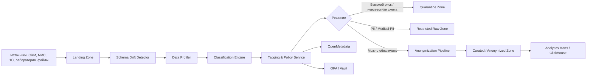

# Движок классификации данных перед загрузкой в аналитическое хранилище

## 1. Цель решения

Перед пакетной загрузкой данных в аналитическое хранилище необходимо автоматически определить класс конфиденциальности данных, присвоить теги и применить защитные преобразования. Это особенно важно для «Медикаменте», потому что источники As-Is содержат Excel, PDF/JPG, 1С, лабораторные реестры и будущие операционные БД, а структуры данных могут меняться без предварительной разметки.

Решение проектируется как слой **Data Classification & Privacy Ingestion Layer** между источниками данных и аналитическим хранилищем.

## 2. Основная идея архитектуры

## 3. Контейнеры движка классификации

| Контейнер | Назначение | Вход | Выход |
|-----------|------------|------|-------|
| **Batch Ingestion Orchestrator** | Управляет пакетной загрузкой, расписанием, retry, idempotency | Файлы, дампы БД, CDC batches | Batch metadata, job status |
| **Landing Zone** | Временная зона приёма данных до классификации | Raw files/tables | Immutable raw copy |
| **Schema Drift Detector** | Определяет изменение структуры: новые поля, типы, пропавшие колонки | Batch schema | Drift report, risk score |
| **Data Profiler** | Строит статистику: cardinality, null ratio, regex matches, value distribution | Sample/full scan | Data profile |
| **Classification Engine** | Определяет классы `public/internal/pii/pii.sensitive/fin/hr/secrets/metadata` | Profile + schema + samples | Labels + confidence |
| **Rules Classifier** | Детерминированные правила: regex, dictionary, column-name heuristics | Field names, values | Rule-based labels |
| **ML/NLP Classifier** | Классифицирует неструктурированные тексты и новые поля | Text/OCR/sample values | Probabilistic labels |
| **Tagging & Policy Service** | Присваивает теги и выбирает политику обработки | Labels + confidence | Tags, policy decision |
| **Human Review Queue** | Очередь ручной проверки для низкой уверенности или высокого риска | Unknown/low confidence data | Approved labels |
| **Privacy Transformation Pipeline** | Маскирование, токенизация, псевдонимизация, обезличивание | Tagged data | Protected datasets |
| **Quarantine Zone** | Изоляция данных, которые нельзя безопасно загрузить | High risk / unknown schema | Manual review dataset |
| **Metadata & Lineage Publisher** | Публикует теги, lineage и результаты классификации | Classification events | OpenMetadata records |

## 4. Слои аналитического хранилища

| Слой | Что хранится | Доступ | Защитные меры |
|------|--------------|--------|---------------|
| **Landing Zone** | Необработанная пачка данных до классификации | Только ingestion-сервис | Шифрование, короткий TTL, запрет BI-доступа |
| **Quarantine Zone** | Данные с неизвестной схемой, низкой уверенностью классификации или высоким риском | Data steward / ИБ / DPO | Изоляция, read-only, ручная проверка |
| **Restricted Raw Zone** | Классифицированные сырые данные с PII/medical/financial | Только ETL и ограниченные администраторы | AES-256, Vault/KMS, ABAC, полный аудит |
| **Cleansed Zone** | Очищенные данные с нормализованными схемами | ETL, владельцы доменов | Теги, контроль качества, lineage |
| **Protected / Anonymized Zone** | Псевдонимизированные, маскированные и агрегированные данные | BI/ML пользователи | Запрет `pii.sensitive`, k-anonymity, aggregation |
| **Analytics Marts** | Витрины ClickHouse для BI/ML | Бизнес-аналитик, отчёты | Только `internal`, `anonymized`, `aggregated` |

## 5. Классы конфиденциальности

| Класс | Примеры | Действие при загрузке |
|-------|---------|-----------------------|
| `public` | Справочник услуг без ПДн | Загрузка в Cleansed/Analytics |
| `internal` | Внутренние справочники, агрегаты | Загрузка в Cleansed/Analytics |
| `pii` | ФИО, телефон, e-mail, адрес | Restricted Raw + маскирование/псевдонимизация |
| `pii.sensitive` | Диагнозы, анализы, хронические заболевания | Restricted Raw, запрет в BI без обезличивания |
| `fin` | Платежи, чеки, договорные суммы | Restricted Raw, токенизация/агрегация |
| `hr` | Зарплата, СНИЛС, кадровые данные | Отдельный HR-контур, запрет общей аналитики |
| `secrets` | API keys, пароли, private keys | Quarantine, инцидент ИБ, запрет загрузки |
| `metadata` | IP, user-agent, имена файлов, audit trail | Псевдонимизация и retention policy |
| `unknown` | Новая схема или низкая уверенность | Quarantine + human review |

## 6. Работа со структурными изменениями

Структуры входных данных считаются нестабильными. Поэтому схема не должна быть жёстко доверенной.

| Событие | Обработка |
|---------|-----------|
| Новое поле | Автоматический profiling + classification; до решения поле не попадает в BI |
| Изменение типа | Schema Drift Detector повышает risk score; batch уходит в quarantine при критичном drift |
| Исчезновение поля | Создаётся schema drift event; downstream витрины переводятся в warning |
| Новая таблица/файл | Загружается только в Landing/Quarantine до классификации |
| Низкая уверенность классификации | Human Review Queue; временный тег `unknown` |
| Обнаружен secret | Batch блокируется, создаётся security incident |

## 7. Метрики эффективности классификации

| Метрика | Что показывает | Как помогает оптимизировать систему |
|---------|----------------|-------------------------------------|
| **Classification precision** | Доля корректных positive-классификаций | Снижает false positives и лишние ручные проверки |
| **Classification recall** | Доля найденных чувствительных данных | Снижает риск попадания PII в аналитику |
| **False negative rate** | Сколько чувствительных полей пропущено | Главная privacy-метрика; используется для ужесточения правил |
| **False positive rate** | Сколько безопасных полей ошибочно помечено чувствительными | Помогает не блокировать полезную аналитику |
| **Coverage ratio** | Доля полей/таблиц, прошедших классификацию | Показывает полноту контроля перед загрузкой |
| **Unknown field ratio** | Доля полей с классом `unknown` | Сигнал о schema drift или недостатке правил |
| **Low confidence ratio** | Доля классификаций ниже порога уверенности | Показывает, где нужны новые правила или обучение модели |
| **Quarantine rate** | Доля batch-загрузок, ушедших в quarantine | Помогает балансировать безопасность и throughput |
| **Mean time to review** | Среднее время ручной проверки | Показывает нагрузку на data steward / ИБ |
| **Processing latency per GB** | Время классификации на объём данных | Нужна для capacity planning и SLA batch-окон |
| **Policy violation count** | Попытки загрузить запрещённые классы в BI | Показывает качество enforcement |
| **Drift events count** | Количество изменений схемы | Помогает управлять источниками и контрактами |

Целевые ориентиры:

- recall для `pii` и `pii.sensitive`: не ниже 0.98;
- false negative rate для `pii.sensitive`: не выше 0.5%;
- coverage ratio: 100% полей перед публикацией в витрины;
- `unknown` не публикуется в BI без ручного решения.

## 8. Масштабируемость

| Направление роста | Решение |
|-------------------|---------|
| Рост объёма данных | Горизонтальное масштабирование workers по batch partitions; Spark/Flink для больших файлов; S3/MinIO как масштабируемое хранилище |
| Рост количества источников | Коннекторная архитектура: CRM connector, MIS connector, 1C connector, Lab connector, File connector |
| Рост числа пользователей BI | Разделение Restricted Raw и Analytics Marts; ClickHouse replicas; row/column-level security |
| Рост числа схем и полей | Schema registry + OpenMetadata; автоматическое создание drift events |
| Рост числа ручных проверок | Active learning: решения data steward пополняют rules/ML model; приоритизация high-risk datasets |
| Рост нагрузки на классификацию | Очереди задач, autoscaling workers, backpressure, отдельные worker pools для OCR/NLP |

## 9. Меры Privacy by Design

1. **Классификация до загрузки в DWH**: ни одно поле не попадает в аналитические витрины без тега.
2. **Default deny**: неизвестные поля и новые схемы уходят в quarantine.
3. **Минимизация данных**: в BI публикуются только нужные поля и только после обезличивания.
4. **Разделение слоёв**: сырые чувствительные данные физически отделены от аналитических витрин.
5. **Data Lineage**: каждый dataset имеет источник, batch id, правила классификации, lineage до витрины.
6. **Policy enforcement**: OPA запрещает публикацию `pii.sensitive` в BI.
7. **Шифрование и аудит**: Landing, Raw, Quarantine и бэкапы шифруются; доступ логируется.

